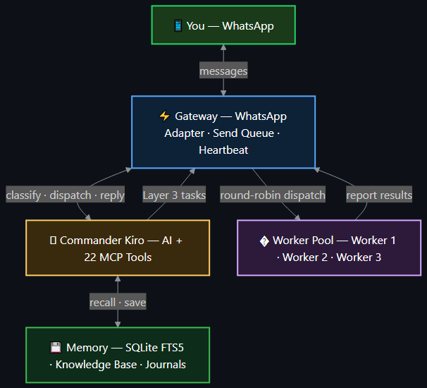
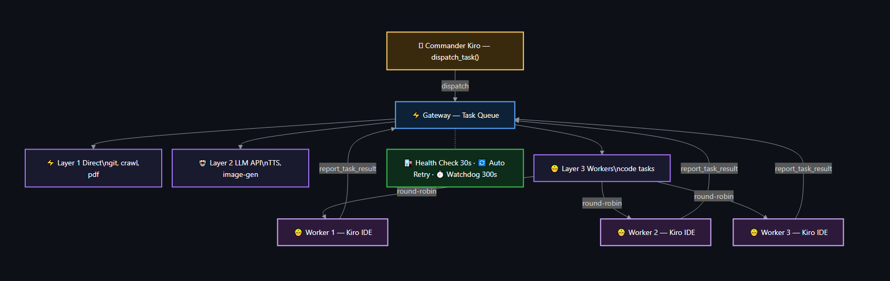

<p align="center">
  
</p>

<p align="center">
  
  
  
  
</p>

<h1 align="center">MyKiroHero</h1>

<p align="center">
  <strong>你的 Kiro AI，現在住進了 WhatsApp。</strong><br/>
  零雲端、零伺服器。掃個 QR Code，魔法就開始了。
</p>

<p align="center">
  🌐 <a href="README.md">English</a> · <a href="README-zh.md">繁體中文</a>
</p>

<p align="center">
  🎬 <a href="https://github.com/user-attachments/assets/4d6c8ba8-1aa1-4f09-afcf-3719bc049e9f"><b>功能總覽 ▶️</b></a>
</p>

https://github.com/user-attachments/assets/4d6c8ba8-1aa1-4f09-afcf-3719bc049e9f

---

> **⚠️ 慢著 — 裝之前先看完這段。**
>
> - WhatsApp 帳號透過 QR Code 連結（跟 WhatsApp Web 一樣）。同時只能有**一個** Web session — 在別處開 WhatsApp Web，這邊就會斷。
> - 所有東西都跑在**你的電腦上**，資料哪都不去。但電腦得開著，AI 才能回你。
> - 底層用 [whatsapp-web.js](https://github.com/pedroslopez/whatsapp-web.js)（Puppeteer）。WhatsApp 隨時可能改介面 — Gateway 會自動修復大部分狀況，但長時間斷線還是有可能。
> - **Windows 用戶**：裝在使用者資料夾下（例如 `%USERPROFILE%\MyHero`），別裝在 `C:\` 根目錄，會踩坑。

---

## 🚀 三步上線

**你需要：** [Node.js 18+](https://nodejs.org/) 和 [Kiro IDE](https://kiro.dev/)。沒了。

```bash
git clone https://github.com/NorlWu-TW/MyKiroHero.git
cd MyKiroHero
node install.js
```

安裝程式帶你走 5 關：環境檢查 → 專案設定 → 人格塑造 → AI 服務（選配）→ 啟動。大約 3 分鐘，泡咖啡的時間都不用。

**掃 QR Code** → 你的 AI 就在 WhatsApp 上線了 🎉

### 已經裝過？升級就好：

```bash
node install.js --upgrade
```

自動拉最新、更新套件，你的設定、資料、人格全部原封不動。

---

## 🏗️ 架構

<p align="center">
  
</p>

---

## 它能幹嘛？

| | 功能 | |
|---|------|---|
| 🗣️ | **WhatsApp 對話** | 手機、平板、電腦 — 隨時隨地跟 AI 聊 |
| 🧠 | **長期記憶** | 記得聊過什麼、寫日誌、全文搜尋 — 它真的會記住 |
| ⏰ | **心跳排程** | 早安問候、自動備份、定時提醒 — 你睡覺它做事 |
| 🎭 | **自訂人格** | 取名字、調語氣、選 emoji — 打造專屬 AI |
| 🖼️ | **圖片 & 語音** | 畫圖、唸給你聽、聽懂你說的 |
| 📨 | **發送佇列** | 訊息不打架 — 文字、圖片、語音乖乖排隊 |
| 🔄 | **自我修復** | 斷線？自動重連。卡住？自動恢復。不用你操心。 |
| 🔌 | **可擴充技能** | 天氣、知識庫、網頁瀏覽，還有你想得到的 |
| 👷 | **多工小隊** | 開多個 Kiro 實例，任務平行處理 |
| 🔒 | **100% 本地** | 資料不出門，句點。 |

---

## 👷 Worker 系統 — 想更大，做更快

<p align="center">
  
</p>

一個 Kiro 很聰明。一群 Kiro 一起幹活？那叫小隊。MyKiroHero 讓你開多個 Worker 實例接任務，Commander 統一調度，結果自動回流。

```bash
node scripts/setup-worker.js          # 互動式設定
node scripts/setup-worker.js worker-4  # 快速設定（指定 ID）
```

### 怎麼運作的

- **三層任務引擎** — Layer 1 秒殺（git、crawl）、Layer 2 呼叫 LLM API（TTS、畫圖）、Layer 3 派給 Worker（寫程式）
- **輪詢分配** — 任務平均撒給閒著的 Worker
- **健康脈搏** — Gateway 每 30 秒 ping 一次，90 秒沒回應就標離線
- **自動歸隊** — Worker 回來了？自動插回隊伍
- **容錯重試** — 一隻 Worker 掛了，任務自動跳到另一隻
- **看門狗計時** — 任務卡太久自動判失敗（預設 300 秒）
- **乾淨取消** — 取消的任務會觸發乾淨回退（清理分支、程式碼重設回 main）
- **結果回報** — Worker 透過 `report_task_result()` 交差，Commander 全程掌握

每個 Worker 有自己的人格、工具和教訓 — 能獨立 commit、push、merge 程式碼。

---

## 💓 Heartbeat — AI 的日常作息

編輯 `.kiro/steering/HEARTBEAT.md`：

```markdown
## Schedules
09:00 早安問候
14:00 檢查待辦事項
04:00 備份記憶
```

Gateway 自動讀取，不用重啟，改了就生效。

---

## 🌐 遠端 Dashboard — 手機也能看

Gateway 啟動時自動建立 [Cloudflare Tunnel](https://developers.cloudflare.com/cloudflare-one/connections/connect-networks/)，給你一個公開 HTTPS URL 直連 Dashboard，不用設 port forwarding。

- URL 啟動時印在 console，也存在 `.tunnel-url`
- 免費版：每次重啟 URL 會變
- WebSocket 自動走 wss://
- 需要 `bin/` 裡有 `cloudflared` 執行檔（首次安裝自動下載，或從 [cloudflare/cloudflared releases](https://github.com/cloudflare/cloudflared/releases) 手動下載）
- 沒有 `cloudflared` 也不會 crash，Gateway 正常啟動只是沒 tunnel

> 小技巧：跟 AI 說「tunnel URL」，它會把連結傳到你的 WhatsApp。

---

## 🔄 備份與還原 — AI 的靈魂可以帶著走

把 AI 的人格和記憶備份到私人 GitHub repo。換電腦？秒還原。

**設定：** 建私人 repo，拿 [Personal Access Token](https://github.com/settings/tokens)（`repo` 權限），丟進 `.env`：

```env
MEMORY_REPO=https://github.com/YourName/SoulAndMemory
GITHUB_TOKEN=ghp_xxxxxxxxxxxx
```

**帶走什麼：** 人格規則、知識庫、日誌、對話記錄、摘要 — 整個靈魂打包。

**備份** 在 `--upgrade` 時自動跑，或直接跟 AI 說「備份記憶」。

**還原** 全新安裝時第 3 步會問你，或隨時：`node install.js --restore`

---

## 🤖 外部 AI 服務 — 選配超能力

Kiro 本身就搞定聊天、記憶和技能。接上外部 AI，解鎖更多玩法：

| 能力 | 支援服務 |
|------|---------|
| 🖼️ 圖片生成 | Gemini、OpenAI、Stability AI、xAI Grok |
| 🗣️ 文字轉語音 | Gemini、OpenAI、ElevenLabs |
| 🎤 語音轉文字 | Gemini、OpenAI、ElevenLabs |

安裝時貼 API key 就好 — 自動偵測、自動設定。之後用 `node install.js --manage-ai` 管理。

> 不接外部 AI？完全沒差。聊天、記憶、技能照常運作，零額外費用。

---

<details>
<summary><h2>📖 技術細節</h2></summary>

### MCP Tools（19 個）

| 工具 | 幹嘛用的 |
|------|---------|
| `whatsapp` | 發訊息或媒體（圖片、檔案、語音） |
| `get_gateway_status` | Gateway 健康檢查 |
| `analyze_image` | 看圖說故事（vision） |
| `get_weather` | 查天氣 |
| `skill` | 管理技能（list / find / load） |
| `knowledge` | 知識庫 — 搜尋、讀取、儲存 |
| `journal` | 日誌（事件、想法、教訓、待辦） |
| `recall` | 跨記憶層搜尋 |
| `session` | Session 管理 — 歷史記錄、待摘要、儲存摘要 |
| `summarize_session` | 取得或儲存對話摘要 |
| `download_file` | 下載檔案 |
| `ai` | AI 服務管理 — 用量統計、服務狀態/重設 |
| `task` | 任務管理 — 派發（Layer 1/2/3）、查狀態、取消 |
| `report_task_result` | Worker 回報完成 |
| `run_tests` | 跑測試，回傳精簡的通過/失敗摘要 |
| `worker` | Worker 管理 — 發送 ops 指令、強制重設卡住的 Worker |
| `git` | Git 遠端操作（fetch/pull/push/clone）及 push queue（lock/unlock） |
| `issue` | Issue Tracker — 建立、列表、更新、關閉、統計 |
| `mc` | Mission Control — 計畫、任務、分析、執行 |
| `restart_gateway` | 重啟 Gateway |

### WhatsApp 穩定性

- **發送佇列** — 所有外發訊息排隊走，零 race condition
- **聰明重試** — 暫時性錯誤退避重試，永久性錯誤快速放棄
- **自動重連** — 指數退避 + cache 清理，卡住的 session 自己修
- **健康監控** — 定期心跳，殭屍連線在你發現之前就被抓到

### 記憶架構

| 層級 | 存在哪 |
|------|-------|
| 對話記錄 | `sessions/YYYY-MM-DD.jsonl` |
| 日誌 | `memory/journals/` |
| 知識庫 | `skills/memory/` |
| 搜尋索引 | `data/memory.db`（SQLite + FTS5） |

### 專案結構

```
MyKiroHero/
├── src/
│   ├── gateway/          # 伺服器、WhatsApp adapter、設定
│   │   ├── handlers/     # 訊息分類、dispatch、IDE handlers
│   │   ├── tasks/        # 任務處理器（tts、image-gen、git-ops、worker-dispatch…）
│   │   └── stt/          # 語音轉文字 adapters
│   ├── memory/           # SQLite+FTS5 引擎、索引器、日誌、搜尋
│   ├── skills/           # Skill 載入器、搜尋引擎
│   └── mcp-server.js     # MCP 工具定義
├── scripts/
│   └── setup-worker.js   # Worker 安裝程式
├── skills/               # 可擴充的 agent 技能
├── templates/            # Steering 範本
├── install.js            # 互動式安裝程式
└── ecosystem.config.js   # PM2 設定
```

</details>

---

## 🤝 一起玩

發現 bug？有什麼鬼點子？[開個 issue](https://github.com/NorlWu-TW/MyKiroHero/issues) 聊聊。

---

## 第三方授權

- **vscode-rest-control** (MIT) © 2024 Darien Pardinas Diaz — [GitHub](https://github.com/dpar39/vscode-rest-control)
- **whatsapp-web.js** (Apache-2.0) — [GitHub](https://github.com/pedroslopez/whatsapp-web.js)

---

<p align="center">
  MIT License · Made with ❤️ in Taiwan
</p>
